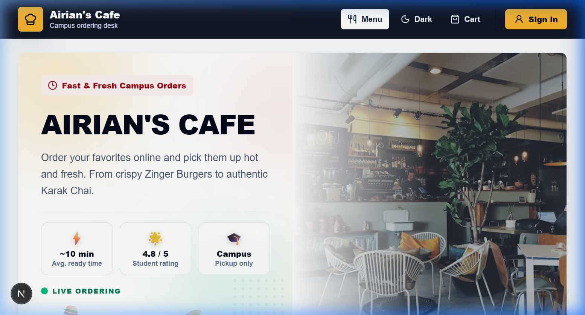

# Airian's Cafe - Enterprise Cafe Ordering System for Campus

A Full-stack, enterprise-grade campus ordering system for standard cafe pre-orders and high-velocity recess batch ordering. The system has been specifically designed to mirror bold, modern fast-food aesthetics.

Recently modernized from a MERN stack to a highly scalable architecture using Next.js 15 (App Router) and NestJS.



## Key Features

### 🍔 Modern Customer Experience
- **KFC-Style Bold Menu:** Endless scrolling menu with a sticky category navigation bar (Scrollspy), massive edge-to-edge food imagery, and high-contrast styling.
- **3-Column Desktop Grid:** Optimized responsive layout that scales beautifully to show 3 columns on standard laptops and desktops.
- **Slide-out Cart Drawer:** A fully integrated global cart drawer that slides out from any page, eliminating blank space issues and improving navigation flow.
- **Custom Order Notes:** Customers can leave specific instructions ("Extra spicy", "No onions") for the kitchen on their entire order.
- **Flexible Payments:** Supports digital Campus Wallet, Cash on Pickup, and manual transfers via JazzCash/Easypaisa.

### 👨‍🍳 Admin & Kitchen Operations
- **Kitchen Dashboard:** Real-time timeline view of all incoming orders with their requested pickup times.
- **Bulk Cooking List:** Automatically aggregates all pending orders into a master checklist (e.g., "Cook 15 Zingers") for high-velocity rush hours.
- **Stock Management:** One-click toggles to instantly hide items from the menu when ingredients run out.

## Stack

- **Frontend:** Next.js (App Router) + React + Tailwind CSS v4 + Lucide Icons
- **State Management:** Redux Toolkit (for cart, auth, and UI state)
- **Backend:** NestJS + TypeScript
- **Database:** MongoDB Atlas through Mongoose
- **Notifications:** UltraMsg (WhatsApp notifications) + Nodemailer (Email OTPs & status alerts)

## Setup & Running the Project

You can install all dependencies and run both the frontend and backend concurrently from the root workspace directory.

### Initial Installation
Install dependencies for both projects in one command:
```bash
npm run install:all
```

### Running in Development
Start both NestJS and Next.js dev servers concurrently:
```bash
npm run dev
```
- **Frontend (Next.js):** `http://localhost:3000`
- **Backend (NestJS):** `http://localhost:8080`

### Production Builds
Build both packages for production:
```bash
npm run build
```

And start them in production concurrently:
```bash
npm run start
```

### Default Admin Credentials (Seeded):
- **Email:** `admin@airianscafe.edu`
- **Password:** `Admin@12345`

*(Change this in `nest-server/.env` before production use!)*
